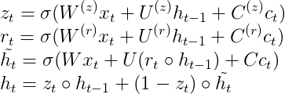
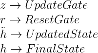

# Keras Bahdanau Attention

## Prelude

Attention Mechanism allows the decoder to focus on specific parts of the input (encoder's output) rather than compressing all the information in the input at once. Since attention weights are trainable, the decoder learns where to focus in the input.

For each time step in the decoder, a context vector should be computed and used for computing the output of that step. To compute a *context vector* for step<sub>t</sub>, the *decoder state* of step<sub>t-1</sub> and the *annotation* (encoder output) at step<sub>t</sub> is required (See Appendix 2.2 of [[1](https://arxiv.org/pdf/1409.0473.pdf)]). Therefore, we need to compute the context vector while executing recurrent steps unlike in works [[2](https://towardsdatascience.com/light-on-math-ml-attention-with-keras-dc8dbc1fad39)], [[3](https://github.com/philipperemy/keras-attention-mechanism)]. :thinking: (To be clarified... Maybe, their hack is theoretically equivalent and more efficient).

To keep things clear and simple (better comprehensible), I modified the GRU implementation of Keras. To do so:
- additional weights and biases are added
- formulas for computing z, r, h_head, and h are modified
- initial state computation is modified
- context vector computation is added

Unnecessary bottlenecks are avoided. However, computation of each step now has additional dot products (for new weights and biases) and context vector computation.


## Cell Design

**Bahdanau Cell Formula**





Note that in [[1](https://arxiv.org/pdf/1409.0473.pdf)], *h_head* corresponds to *s_head* and *h* corresponds to *s*. In addition, in Keras's implementation *h_head* corresponds to *hh*. Also, *W's* are named as *kernel* while *U's* are named as *recurrent_kernel* in Keras's implementation. For *C's*, I named them as *attention_kernel*.

Please note that, the biases are not shown in the formulas but they are used (or let's say they are optional as in original GRU implementation).

## Walkthrough

We will first get a copy of GRU and GRUCell, then modify them to create Bahdanau Layer and cell.

* Rename the name of the GRU class to BahdanauGRU and it extends RNN class as GRU do.
```python
class BahdanauGRU(RNN):
...
```
* Change the cell instance in the init method to BahdanauGRUCell (which we will create soon). Note that the arguments of BahdanauGRUCell is the same as GRUCell; but you can add any other arguments for your other custom cells.

```python
 cell = BahdanauGRUCell(units,...)
```
* In the init method, assign inputs to the annotations that are kept in the cell. These will be used in context vector computation. Also, compute the step independent part of the context vector computation [[1](https://arxiv.org/pdf/1409.0473.pdf)], see page-14. So, we do not need to re-compute it at each step of the RNN.
```python
self.cell.annotations=inputs
self.cell.compute_step_independent_part_of_eij(inputs)
```

* Also, update the call for super class.
```python
 super(BahdanauGRU, self).__init__(cell,...)
```
* Override the get_initial_state method (which is originally provided in RNN class). Note that *inputs* represents the encoder states for the given batch (batch dimension, time dimension, state dimension). We only take backward states as described in [[1](https://arxiv.org/pdf/1409.0473.pdf)], see page-13. Ws and Ws_bias are the corresponding weights and biases.
```python
 def get_initial_state(self, inputs):
        # For bahdanau attention, inputs will be backwards states of the bidirectional lstm
        # self.backward_encoder_states_length=inputs.shape[-1] / 2
        backward_encoder_states_at_first_step=inputs[:, 0, : -1 * self.cell.backward_encoder_states_length]
        h0 = K.dot(backward_encoder_states_at_first_step, self.cell.Ws)
        h0 = K.bias_add(h0, self.cell.Ws_bias)
        return [self.activation(h0)]
```

Now, let's create the cell:

* Rename the name of the GRUCell class to BahdanauGRUCell and it extends Layer class as GRUCell do.
```python
class BahdanauGRUCell(Layer):
```
* Also, update the call for super class.
```python
 super(BahdanauGRUCell, self).__init__(**kwargs)
```

* *build* function is where we create weights and biases.

* Let's, first, get length of feature dimension in the input. Then, compute the length of the backward states. We know that it is the last half of the input features.
```python
feature_dim_length = input_shape[-1]
self.backward_encoder_states_length = feature_dim_length // 2
self.annotations=None
```

* Now, add the weights required for attetion mechanism:
  - **attention_kernel**: Used when computing values of gates (z,r,h_head).
  - **Ws**: Used when initializing the hidden state.
  - **Wa**: Used when computing e_ij (weights for previous hidden state).
  - **Ua**: Used when computing e_ij (weights for annotations).
  - **va**: Used when computing e_ij.

* Please also observe the *shapes* of the weights...

```python
self.attention_kernel = self.add_weight(
            shape=(feature_dim_length, self.units * 3),
            name='attention_kernel',
            initializer=self.recurrent_initializer,
            regularizer=self.recurrent_regularizer,
            constraint=self.recurrent_constraint)

self.Ws=self.add_weight(shape=(self.backward_encoder_states_length, self.units),
                                name='Ws',
                                initializer=self.kernel_initializer,
                                regularizer=self.kernel_regularizer,
                                constraint=self.kernel_constraint)

self.Wa = self.add_weight(shape=(self.units, self.units),
                                name='Wa',
                                initializer=self.kernel_initializer,
                                regularizer=self.kernel_regularizer,
                                constraint=self.kernel_constraint)

self.Ua = self.add_weight(shape=(feature_dim_length, self.units),
                                name='Wa',
                                initializer=self.kernel_initializer,
                                regularizer=self.kernel_regularizer,
                                constraint=self.kernel_constraint)

self.Va = self.add_weight(shape=(self.units,),
                                name='Va',
                                initializer=self.kernel_initializer,
                                regularizer=self.kernel_regularizer,
                                constraint=self.kernel_constraint)

```
* If *self.use_bias* is true, we create biases as well (Otherwise, they will be None).

```python
self.Ws_bias = self.add_weight(shape=(self.units,),
                                           name='Ws_bias',
                                           initializer=self.bias_initializer,
                                           regularizer=self.bias_regularizer,
                                           constraint=self.bias_constraint)

self.attention_bias = self.add_weight(shape=(3 * self.units,),
                                name='attention_bias',
                                initializer=self.bias_initializer,
                                regularizer=self.bias_regularizer,
                                constraint=self.bias_constraint)

self.Wa_bias = self.add_weight(shape=(self.units,),
                                name='Ws_bias',
                                initializer=self.bias_initializer,
                                regularizer=self.bias_regularizer,
                                constraint=self.bias_constraint)

self.Ua_bias = self.add_weight(shape=(self.units,),
                                name='Ua_bias',
                                initializer=self.bias_initializer,
                                regularizer=self.bias_regularizer,
                                constraint=self.bias_constraint)
```

```python
self.Ws_bias = None
self.attention_bias = None
self.Wa_bias = None
self.Ua_bias = None
```
* Also, define self.Uah, which is step independent part of e_ij.
```python
self.Uah = None
```

* Create attention weights and biases for specific gates:
```python
self.attention_kernel_z = self.attention_kernel[:, :self.units]
self.attention_kernel_r = self.attention_kernel[:, self.units:self.units * 2]
self.attention_kernel_h = self.attention_kernel[:, self.units * 2:]
```

* If self.use_bias is true:
```python
self.attention_bias_z = self.attention_bias[:self.units]
self.attention_bias_r = self.attention_bias[self.units: self.units * 2]
self.attention_bias_h = self.attention_bias[self.units * 2: self.units * 3]
```
* Otherwise:
```python
self.attention_bias_z = None
self.attention_bias_r = None
self.attention_bias_h = None
```

* Now, add the functions for computing context:
```python
def compute_step_independent_part_of_eij(self, annotations):
        self.Uah=K.dot(annotations, self.Ua)
        if (self.use_bias):
                self.Uah = K.bias_add(self.Uah, self.Ua_bias)
```

```python
def compute_c_t(self, h_tm1):
        repeated_state=K.repeat(h_tm1, K.int_shape(self.annotations)[1])
        Was=K.dot(repeated_state, self.Wa)
        if(self.use_bias):
                Was=K.bias_add(Was, self.Wa_bias)
        Was=K.tanh(Was + self.Uah)
        Va_expanded=K.expand_dims(self.Va)

        eij=K.dot(Was, Va_expanded)
        alpha_ij=K.softmax(eij, axis=1)
        c_t=K.batch_dot(alpha_ij, self.annotations, axes=1)
        c_t=K.squeeze(c_t,1)

return c_t
```
* For computing c_t, a similar implementation is used as in [[4](https://github.com/xisnu/KerasBahdanauAttention/blob/master/PSMRNN.py)].

* Now, let's observe the call function of the cell:
  - c_t is computed.
  - Attention parts of the gates (z,r,h_head) are computed.
  - z,r and h_head are computed (now, by adding the attention part).

```python
c_t = self.compute_c_t(h_tm1)
```

```python
attention_z = K.dot(c_t, self.attention_kernel_z)
attention_r = K.dot(c_t, self.attention_kernel_r)
attention_h = K.dot(c_t, self.attention_kernel_h)
if self.use_bias:
        attention_z = K.bias_add(attention_z, self.attention_bias_z)
        attention_r = K.bias_add(attention_r, self.attention_bias_r)
        attention_h = K.bias_add(attention_h, self.attention_bias_h)
```

```python
z = self.recurrent_activation(x_z + recurrent_z + attention_z)
r = self.recurrent_activation(x_r + recurrent_r + attention_r)
hh = self.activation(x_h + recurrent_h + attention_h)
```

* Note that, cell has 2 implementations (as originally in GRU cell).
  - For implementation 1, inputs projected separately for the gate matrices.
  - For the other, inputs projected by all gate matrices at once.

* However, I kept attention computation independent of that implementation choice. Maybe, (for the other implementation), we may include attention weights in the kernel.

```python
```
## References
[1] [NEURAL MACHINE TRANSLATION BY JOINTLY LEARNING TO ALIGN AND TRANSLATE](https://arxiv.org/pdf/1409.0473.pdf)

[2] https://towardsdatascience.com/light-on-math-ml-attention-with-keras-dc8dbc1fad39

[3] https://github.com/philipperemy/keras-attention-mechanism

[4] https://github.com/xisnu/KerasBahdanauAttention/blob/master/PSMRNN.py